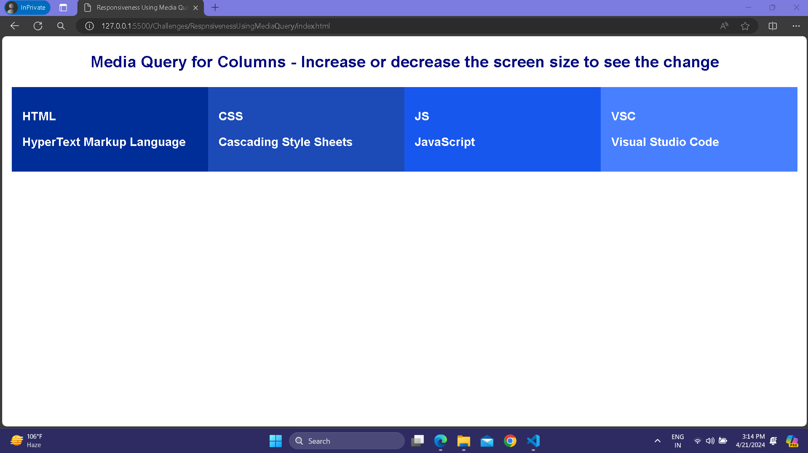
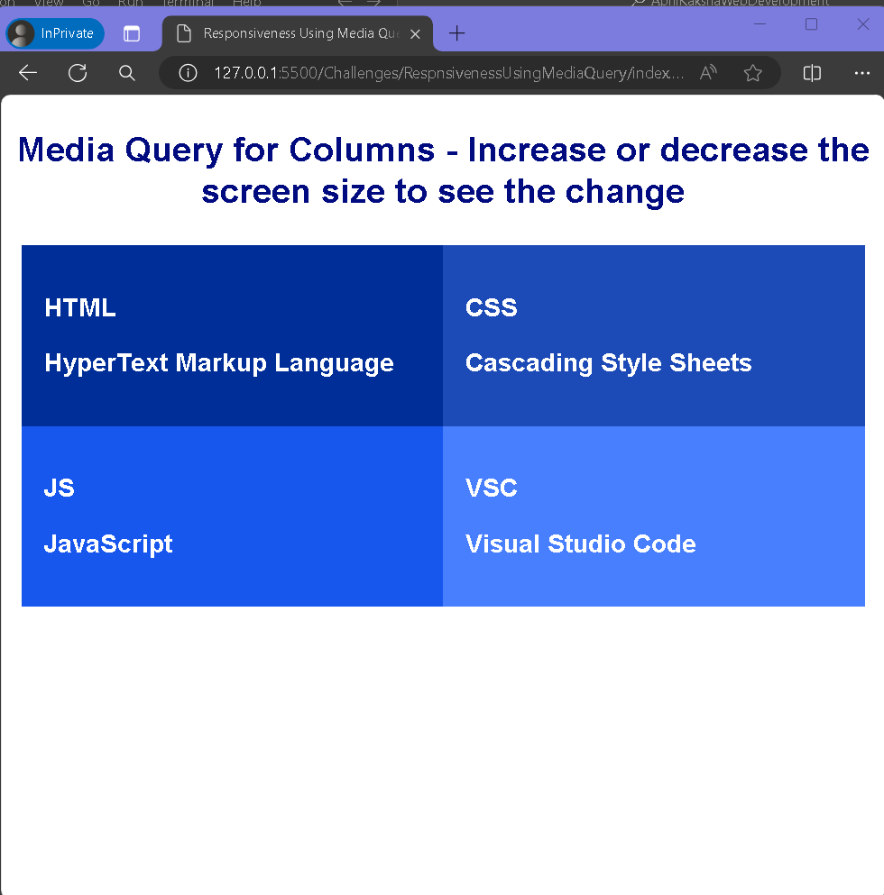
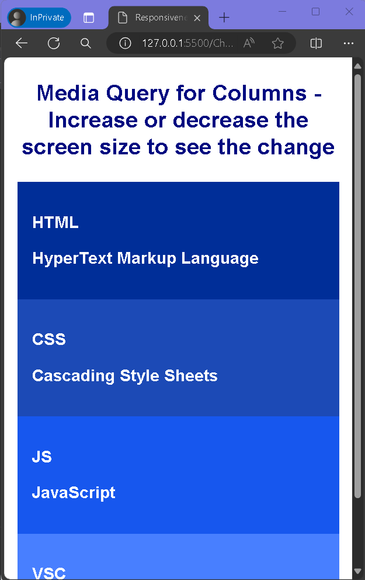

# Responsive-Page-1
 

  

  <h3 align="center">A Responsive Page</h3>

## About The Project
On my jouney to become a fullstack web developer, I have implemented responsiveness using media query for 3 screen aspect ratio.
 
 
<ul><li>For Screen with Aspect Ratio more than 800px</li></ul>

<ul><li>For Screen with Aspect Ratio within 500px and 800px</li></ul>

<ul><li>For Screen with Aspect Ratio Less than 500px</li></ul>

 
 
<h2>Built With</h2> 
<ul>
  <li>HTML</li>
  <li>CSS</li>
</ul>

## Author

* **Zunaid Hossain** - *A Tech Enthusiast* - [Connect with me on LinkedIn](https://www.linkedin.com/in/zunaid-hossain-70b891235/)

